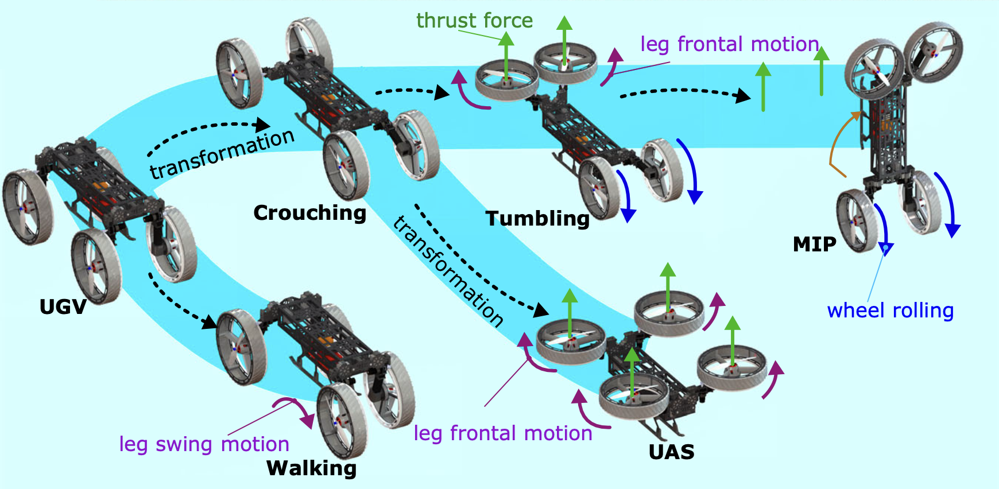

# M4 Navigation

## Overview
The M4 Navigation is a project designed to implement a ROS-based autonomous navigation pipeline for the M4 robot. This repository contains the necessary code and tools to simulate, test, and deploy the navigation stack on the robot.


The M4 robot is a multimodal platform developed at Caltech for complex terrain exploration. The robot shows a high degree of modularity thanks to its many actuators that allow it to change shape depending on the terrain configuration. Also equiped with propellers, the robot is the perfect platform to explore unknown terrain and go over obstacles that would otherwise be too complex to overcome on the ground.



## Table of Contents
- [Overview](#overview)
- [Content](#content)
- [Features](#features)
- [Installation](#installation)
- [Usage](#usage)
- [Examples](#examples)
- [Contributing](#contributing)
- [License](#license)
- [Contact](#contact)


## Content

This repository is organized around two main folders:
- simulation_world
- simulation_slam

### Simulation_world

This folder regroups every modules related to the M4 itself (URDF models, controller configurations, control scripts), Gazebo worlds and RVIZ config files. Launch files are also provided to load the worlds and test the robot in simulation.

### Simulation_slam

This is where the navigation comes alive. This folder includes the navigation modules and the launch files for the autonomous navigation.

## Features
- Integration with RTAB-MAP for mapping
- Integration with MoveBase planner (local & global)
- Integration with PCL for point cloud processing
- Implementation and selection of various navigation modes (using either Standard ROS or RL-based pipelines):
  - ROLLING: for standard obstacle avoidance
  - CRAWLING: under bridge-like obstacles
  - FLIGHT: for going above obtacles (not connected to flight controller yet...)
- Integration with Gazebo simulation environment
- Real-time visualization with RVIZ


## Installation
### Prerequisites
- Python 3.x
- ROS (Robot Operating System) NOETIC
- Dependencies listed in `requirements.txt`
- Realsense Library (https://github.com/issaiass/realsense2_description)

### Steps
1. Clone the repository:
    ```sh
    git clone https://github.com/Quentin2000/M4_Navigation.git
    ```
2. Navigate to the project directory:
    ```sh
    cd M4_Navigation
    ```
3. Install the required dependencies:
    ```sh
    pip install -r requirements.txt
    ```

## Usage
1. Launch the simulation environment:
    ```sh
    cd ~catkin_ws/src/M4_Navigation/simulation_world/launch
    roslaunch gazebo_rviz.launch
    ```
2. Run the autonomous navigation:
    ```sh
    cd ~catkin_ws/src/M4_Navigation/simulation_slam/launch
    roslaunch simulation_merged.launch
    ```

## License
This project is licensed under the MIT License. See the [LICENSE](LICENSE) file for details.

## Contact
For questions or feedback, please contact:
- Quentin2000 (GitHub Profile: [Quentin2000](https://github.com/Quentin2000))

